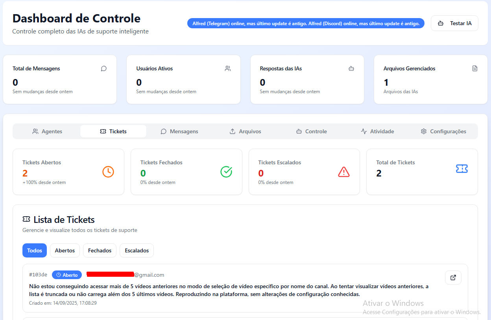

# Employers AI: Agentes de Suporte para SaaS

## Status dos Canais de Comunicação

✅ **Telegram** - Totalmente funcional e operacional  
✅ **Discord** - Totalmente funcional e operacional  
🚧 **WhatsApp** - Em desenvolvimento

---

## Visão Geral

**Employers AI** é um MVP (Produto Mínimo Viável) que revoluciona o suporte ao cliente para empresas de SaaS, utilizando **agentes de IA** para automatizar e otimizar o atendimento em múltiplos canais. O projeto centraliza a gestão de suporte em uma plataforma unificada, liberando equipes humanas para tarefas mais estratégicas.

Com integração **completa e testada** no **Telegram e Discord**, e desenvolvimento ativo da integração com **WhatsApp**, nossa solução oferece cobertura abrangente dos principais canais de comunicação utilizados por equipes de suporte modernas.

---

## Problemas Resolvidos

Nosso sistema foi desenvolvido para superar desafios comuns no atendimento ao cliente, proporcionando eficiência e consistência:

* **Redução do Tempo de Resposta:** Nosso agente de IA oferece **respostas instantâneas e consistentes**, eliminando gargalos e filas de espera, mesmo em picos de demanda.
* **Padronização e Qualidade do Atendimento:** Diferentemente do suporte humano, que pode variar, nosso agente garante **respostas padronizadas e de alta qualidade** com base em uma base de conhecimento centralizada.
* **Disponibilidade em Múltiplos Canais:** O sistema já unifica o atendimento nas plataformas **Telegram e Discord** (funcionais), com **WhatsApp em desenvolvimento**, eliminando a necessidade de equipes ou ferramentas separadas para cada canal.
* **Escalabilidade Ilimitada:** O agente de IA lida com um número virtualmente ilimitado de usuários simultaneamente, permitindo que o suporte escale sem aumentar os custos operacionais.
* **Otimização de Recursos Humanos:** Em vez de substituir a equipe, a IA assume tarefas repetitivas, permitindo que os profissionais de suporte se concentrem em problemas complexos que exigem inteligência emocional e pensamento estratégico.
* **Armazenamento e Recuperação de Conhecimento:** O agente utiliza uma **base de conhecimento viva e atualizável**, resolvendo a dispersão de informações e centralizando o acesso a dados relevantes para o suporte.

---

## Características do MVP

O MVP atual é robusto e serve como uma base sólida para expansão futura. Ele inclui:

### Gerenciamento e Monitoramento

* **Suporte 24/7:** Disponibilidade contínua no **Telegram e Discord** (operacionais) para clientes SaaS, com **WhatsApp** sendo desenvolvido.
* **Dashboards de Desempenho:** Painéis visuais para monitorar métricas importantes, como o número de interações, tipos de perguntas frequentes e taxas de resolução automática.
* **Gerenciamento Centralizado:** Uma interface web para gerenciar configurações do bot (tokens, IDs de canal, modelo de IA) sem a necessidade de manipular arquivos ou o banco de dados diretamente.
* **Controle de Agentes:** Painel com endpoints para iniciar, reiniciar, pausar e deletar contêineres Docker de agentes específicos, incluindo os **agentes funcionais do Discord e Telegram**.
* **Log e Auditoria:** Visualização simplificada de logs para monitorar o funcionamento do agente e identificar problemas rapidamente.

### Base de Conhecimento

* **Upload Facilitado:** Interface intuitiva com funcionalidade **"drag-and-drop"** para o upload de arquivos (`.md`, `.txt`, `.csv`, `.json`) que servem como base de conhecimento para o agente Alfred.
* **Armazenamento Persistente:** O conteúdo dos arquivos e as interações do agente são registrados e armazenados de forma persistente em um banco de dados **PostgreSQL**, permitindo auditoria e análise posterior.

### Funcionalidades de IA e Ferramentas

* **Moderação Inteligente:** Capacidade de ativar moderação de conteúdo usando IA e limites de banimento para combater spam.
* **Ferramentas Ativas (Tools):** O agente Alfred pode ser configurado com funções para executar tarefas complexas, como:
    * `OpenSupportTicketProblem`: Criação de tickets de suporte no banco de dados.
    * `GearAssist_Technical_Support`: Geração de boletins técnicos para problemas específicos.
    * `RecordCSAT`: Coleta de pontuação de satisfação do cliente (CSAT).
    * `CloseSupportTicketProblem`: Fechamento de tickets após a resolução e coleta da CSAT.

---

## Requisitos de Backend e Endpoints

O backend da aplicação é construído em Python e expõe uma série de endpoints RESTful para gerenciar todas as funcionalidades do sistema.

### 1. Endpoint Geral de Configuração

* `GET /api/config`: Busca todas as configurações do bot e do agente Alfred.
* `POST /api/config`: Persiste as configurações atualizadas.

### 2. Gerenciamento de Arquivos da Base de Conhecimento

* `POST /api/alfred-files/upload`: Recebe novos arquivos de conhecimento.
* `GET /api/alfred-files`: Retorna a lista de arquivos de conhecimento gerenciados.
* `GET /api/alfred-files/{fileId}/content`: Retorna o conteúdo de um arquivo específico para visualização.
* `PUT /api/alfred-files/{fileId}/content`: Atualiza o conteúdo de um arquivo.
* `DELETE /api/alfred-files/{fileId}`: Remove um arquivo da base de conhecimento.

### 3. Painel de Mensagens

* `GET /api/messages/recent`: Obtém uma lista das mensagens e interações mais recentes.
* `GET /api/messages/{interactionId}`: Retorna o histórico completo de uma conversa específica.

### 4. Gerenciamento de Usuários

* `GET /api/users`: Lista os usuários que interagiram com o bot.
* `POST /api/users/{userId}/ban`: Bane um usuário específico.
* `POST /api/users/{userId}/unban`: Remove o banimento de um usuário.

### 5. Monitoramento e Métricas

* `GET /api/metrics/realtime`: Fornece métricas em tempo real (mensagens por hora, usuários online).
* `GET /api/activities`: Retorna o log de atividades completo do sistema (mensagens, banimentos, uploads).
* `GET /api/dashboard/stats`: Obtém estatísticas gerais para os cartões do dashboard.
* `GET /api/alfred/status`: Verifica o status operacional do agente Alfred.

---

## Tecnologias e Arquitetura

O projeto utiliza uma arquitetura modular e escalável:

* **Backend:** Python
* **Frontend:** React
* **Orquestração:** **Docker Compose** para gerenciar os serviços de backend, frontend e agentes (Discord, Telegram).
* **Banco de Dados:** **PostgreSQL** para armazenamento persistente de configurações, interações e status.
* **IA:** Integração com modelos de linguagem como `ominilatest`, `gpt-4` e `claude-3` via bibliotecas de agentes de IA.

## Roadmap de Desenvolvimento

### ✅ Concluído
* Integração completa com Telegram
* Integração completa com Discord
* Interface web de gerenciamento
* Base de conhecimento com upload de arquivos
* Sistema de métricas e monitoramento

### 🚧 Em Desenvolvimento
* **Integração com WhatsApp** - Implementação da API e conectores

### 📋 Próximas Fases
* **Criação de Agentes Personalizados:** Uma nova página permitirá a criação de novos agentes com fotos, nomes e áreas de atuação personalizadas (Suporte, Vendas, Atendimento, etc.).
* **Dashboards de Consumo:** Métricas de recursos consumidos (CPU, memória) pelos servidores de agentes (Telegram, Discord, WhatsApp).
* **Integração com Ferramentas de Terceiros:** Expansão das ferramentas do agente para integrar-se com CRMs e outras plataformas.